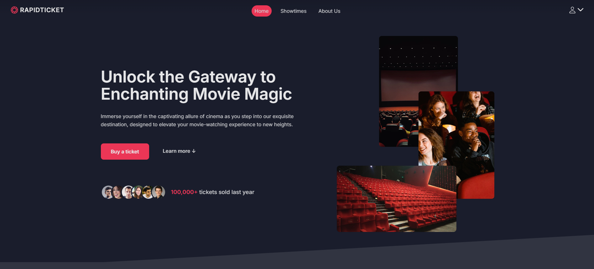
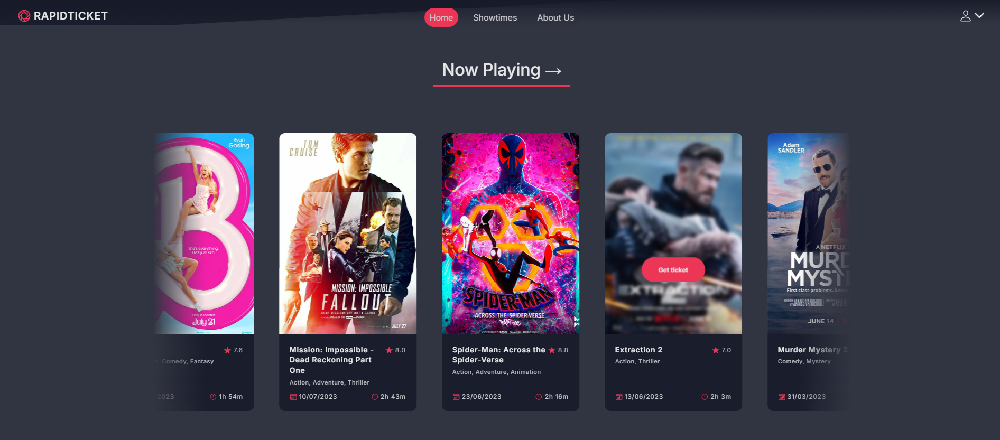
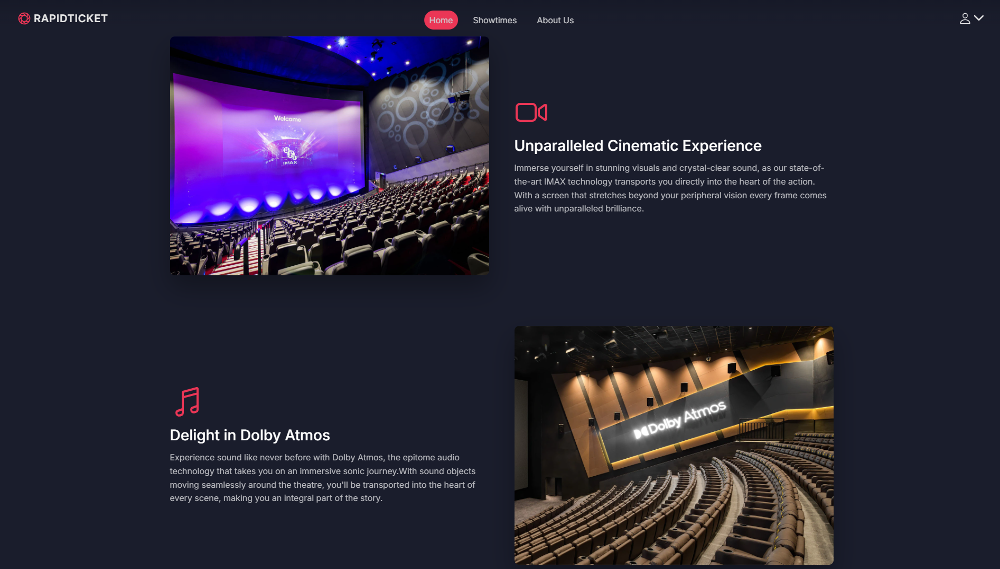
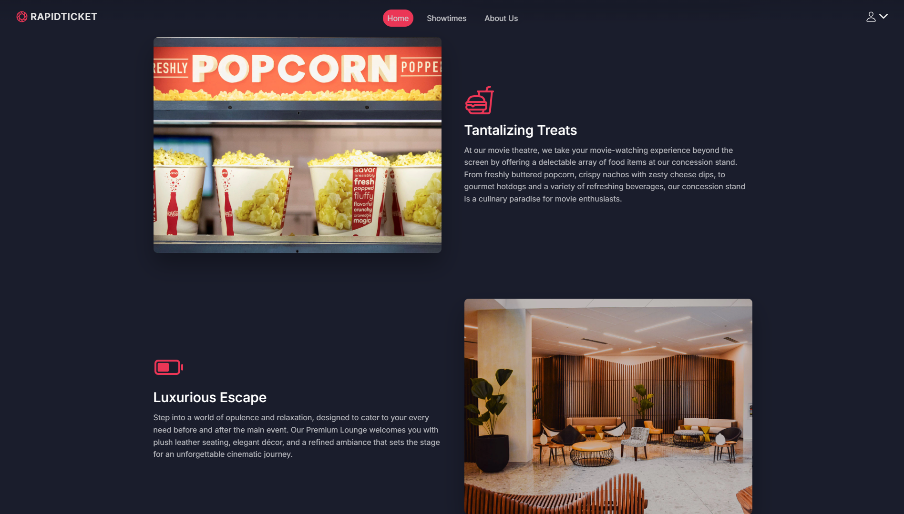
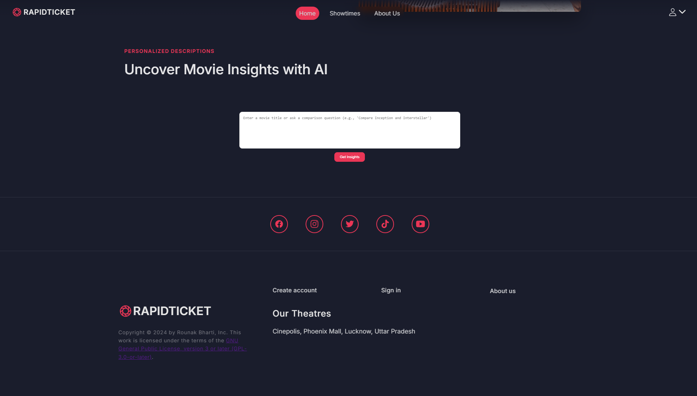
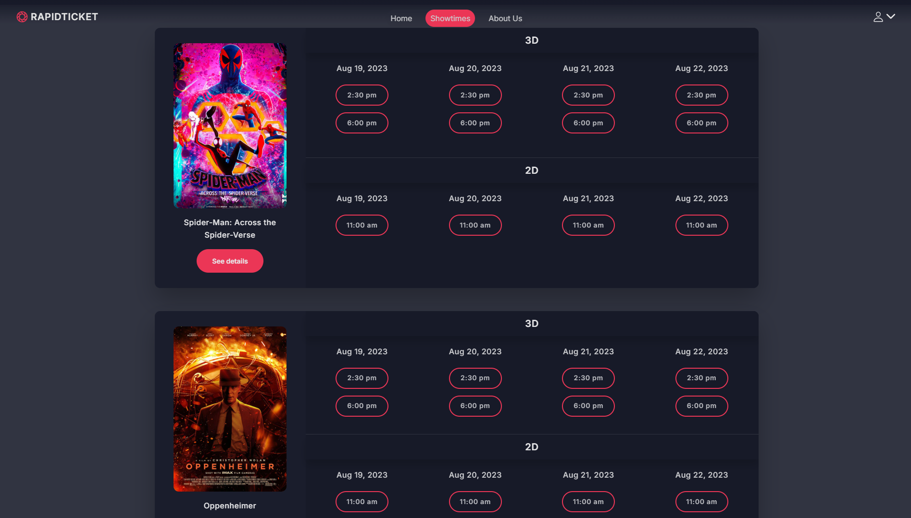
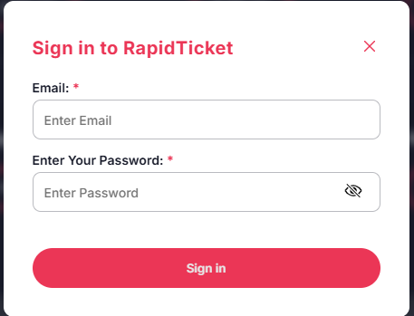
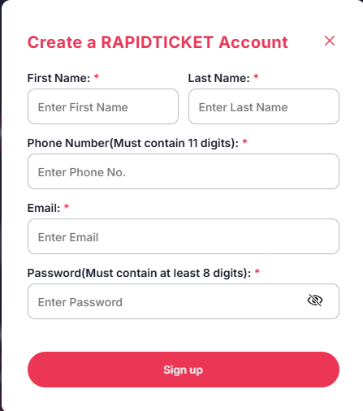

# 🎟️ RapidTicket – Real-Time Ticket Booking System  

RapidTicket is a real-time movie ticket booking platform designed to handle concurrent bookings, ensure dynamic seat allocation, and provide instant updates using WebSocket technology. It enhances the user experience by allowing seamless ticket reservations with real-time feedback and booking history tracking.

---

## 📸 Demo  
### 🎬 User Interface  
  
  
  
  
  
  
  
  
  
 

---

## 🚀 Features  

### 🎭 For Users  
- 🔍 **Browse Movies & Shows** – Explore available movies and showtimes  
- 🎫 **Book Tickets in Real-Time** – Secure instant seat reservations  
- 📡 **Live Updates** – Receive real-time booking confirmations and seat availability updates  
- 📜 **View Booking History** – Track past bookings and upcoming reservations  

### 🎩 For Administrators  
- 🏢 **Manage Movie Listings** – Add, update, and remove movies and showtimes  
- 🎟️ **Monitor Bookings** – View and manage seat reservations  
- 📢 **Send Announcements** – Notify users of offers and schedule changes  

---

## 🛠️ Technologies Used  
- **Frontend:** ReactJS, JavaScript, CSS, Bootstrap  
- **Backend:** Node.js, Express.js  
- **Database:** MongoDB  
- **Real-Time Communication:** WebSocket  

---
## 📩 Contact & Support  
📧 **Email:** [bhartirounak@gmail.com](mailto:bhartirounak@gmail.com)  
🔗 **GitHub:** [https://github.com/rounakbharti](https://github.com/rounakbharti)  
🌐 **Project Repository:** [RapidTicket](https://github.com/rounakbharti/RapidTicket)  

💡 *For any issues, feel free to open a GitHub issue!* 🚀  

